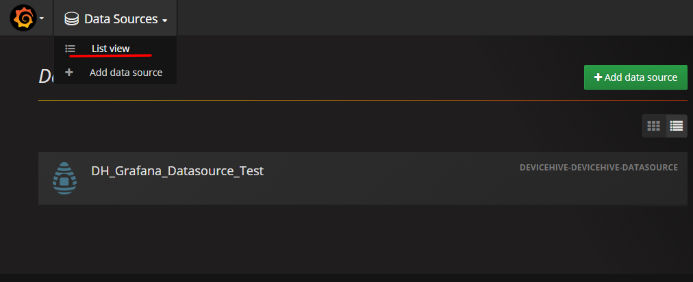

DeviceHive is an IoT platform which has plenty of different components. The Grafana plugin is one of them. This plugin can gather data from a DeviceHive server and display it with different dashboards using the very popular tool - Grafana. This article explains how to create a Grafana dashboard with DeviceHive. As an example, this uses the ESP8266 chip analog pin to visualise the voltage on it.


## Data

To display anything on a dashboard we need data. In terms of a DeviceHive server, data can be provided via 'commands' and 'notifications'. Commands are typically used to deliver any messages to a device which the device should execute while 'notifications' are the opposite, devices notify their subscribers about certain events. 'Commands' and 'notifications' are basically simple JSON messages. Both of these two entities can be used to plot graphs, display static text, a gauge, table or any other Grafana components. For this article we will generate notifications using special DeviceHive firmware for the ESP8266 chip. This firmware allows the chip to connect directly to a DeviceHive server using its protocol and has plenty of [documented commands](https://github.com/devicehive/esp8266-firmware/blob/develop/DeviceHiveESP8266.md) which can be issued from the server side.

## Generating notifications with ESP8266 firmware

The binaries for the DeviceHive firmware are available [here](https://github.com/devicehive/esp8266-firmware/releases). Download the latest version and flash this firmware to your chip. The release archive contains documentation on how to do that, but if you have a 'nodemcu'-like board you just need to connect the board via a microUSB cable to your computer and run the 'esp-flasher' util from the release archive for your operating system and wait until it flashes the board. Having flashed the board, there is a need to configure the chip which Wi-Fi network, DeviceHive server, and credential it should use. There are two ways to do that: using a posix-like terminal with the 'esp-terminal' util or wirelessly as described [here](https://github.com/devicehive/esp8266-firmware/blob/develop/DeviceHiveESP8266.md#wireless-configuring).

There is a [free playground service](https://playground.devicehive.com/), which can be used for absolutely free to try a DeviceHive server. After your chip is connected to your server or playground, go to the server admin panel, find your ESP8266 device in the device list and issue the 'adc/int' command with the parameters '{"0": 500}'.


This command causes the esp8266 to report every 500ms the voltage on ADC input #0(the only ESP8266 has). After switching to 'notifications' there should be screen like:


That is the voltage on the chip's input pin. And this kind of data is suitable for us to display with Grafana: notifications contain data (parameters in our case), notifications come continuously, and all DeviceHive's notifications always have a timestamp. Having an analogue sensor connected to this pin it is possible to display this data with Grafana.

## Installing the DeviceHive Grafana plugin to Grafana

Grafana can be used as a local service or as a hosted service. To install Grafana locally, please, refer to the ["Official documentation. Grafana installation."](http://docs.grafana.org/installation/)

You can find how to install plugins in the ["Official documentation. Plugin installation."](http://docs.grafana.org/plugins/installation/)

To install DeviceHive datasource via grafana-cli you can use the following command:

```text
$ grafana-cli plugins install devicehive-devicehive-datasource
```

If you want to install the plugin manually, you should perform the following steps:

Prerequisites, these packages should be installed:

1. Grafana >= 4.6
2. NodeJs >= 8 (optional)
3. NPM >= 5 (optional)
4. Grunt (npm install grunt -g) (optional)

Also you should have permissions to copy data to the Plugins folder (you could set it in `grafana.ini` in `Paths->plugins`).

1. Clone this repo to the Plugins folder - `git clone`  
   `https://github.com/devicehive/devicehive-grafana-datasource.git`;
2. Next steps are optional (in case if you want to rebuild datasource sources code)  
   2.1 Go into folder - `cd devicehive-grafana-datasource`;  
   2.2. Install all packages - `npm install`;  
   2.3. Build plugin - `npm run build`;
3. Restart Grafana server
4. Open Grafana in browser;
5. Open the side menu by clicking the Grafana icon in the top header;
6. In the side menu click `Data Sources`;
7. Click the `+ Add data source` in the top header;
8. Select `DeviceHive` from the `Type` dropdown;
9. Configure the datasource.

After installation you will be able to see the DeviceHive datasource plugin in the installed plugins list (look at the picture below).


## Adding grafana datasource

To add DeviceHive datasource, you should perform the following steps:

1. Open the side menu by clicking the Grafana icon in the top header;
2. In the side menu click `Data Sources`;
3. Click the `+ Add data source` in the top header;
4. Select `DeviceHive` from the `Type` dropdown;

Look at the picture below:


To configure the DeviceHive datasource you should fill on the following fields:

Server URL (is the path to the DeviceHive WebSocket server. For the playground this is ws://playground.devicehive.com/api/websocket)  
Device ID (unique identifier of the DeviceHive device)  
Login/Password or AccessToken - credentials to pass authentication

Also, you are able to specify the RefreshToken for auto refreshing the AccessToken

On the picture below you can observe the configuration workflow:


After adding and configuring a DeviceHive datasource, it should exist in the datasource list as in the picture below:



## Create new dashboard

To create a new dashboard you should just click on the “New” button in the sidebar panel as shown in the picture below:


In this article we will show examples on the Graph panel, so, click on the Graph button:


After that you will be able to see line chart on your dashboard:


## Displaying notifications/commands with Grafana's graph

Notification and commands are DeviceHive entities:  
Command: represents a message dispatched by clients for devices  
Notification: represents a message dispatched by devices for clients

By default, a Notification or Command message provides the field named “parameters” in which a user can pass their own data.

At the start of this article we configured the ESP8266 device to send notifications with data that represents the state on analogue pin#0 of the chip. In the picture below you are able to observe how to configure the Grafana graph panel to make it show the data on the line chart:


## Displaying annotations on Grafana's graph

Annotations provide a way to mark points on the graph with rich events. When you hover over an annotation you can get an event description and event tags. The text field can include links to other systems with more detail.  
More information about annotations you can find by following this link.

The picture below shows how to configure annotations powered by a DeviceHive datasource.


## Advanced graph tuning

After clicking on the "Add converter" button you will be able to select a converter.  
A converter is the simple function that transforms a value in some way.

For now, DeviceHive datasources support the following types of converters:

- Scale - multiplies by a given value
- Offset - adds a given value
- Unit converter - converts value between different units of below mentioned measurement types:
- Temperature ('c' - Celsius, 'f' - Fahrenheit, 'k' - Kelvin)
- Length ('m' - Meter, 'mi' - Mile, 'yd' - Yard, 'ft' - Feet, 'in' - Inch)
- Weight ('kg' - Kilogram, 'lb' - Pound, 'oz' - Ounces)
- Volume ('l' - Liter, 'gal' - Gallon, 'pt' - Pint)


An example of this functionality is shown in the picture below.


## Conclusion

Grafana is a perfect tool to visualise data. It is very flexible and provides many different features to make visualisation in a way they you like. Grafana can use many data sources from a wide range of software solutions and DeviceHive is one of them. The sample which we described in this article is very simple. Using these principles it is possible to create more advanced graphs and we hope it will be helpful for you. Using Grafana and DeviceHive you can build your own IoT visualisation solutions and moreover you can modify both projects as you wish since Grafana and DeviceHive are open source software.

Written by Igor Trambovetskiy, Senior Developer at [DataArt](https://www.dataart.com/iot)
