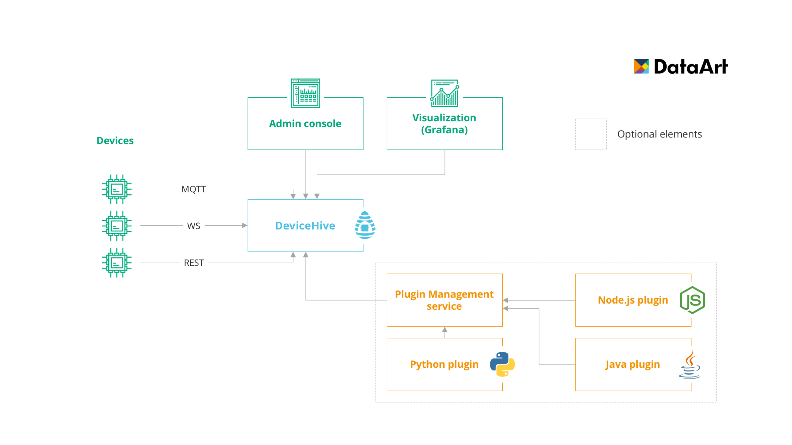

# What is DeviceHive?

DeviceHive is an open source platform which provides instruments for your smart devices communication and management. It consists of the communication layer, control software and multi-platform libraries and clients to bootstrap development of smart energy, home automation, remote sensing, telemetry, remote control and monitoring software and much more.

Speaking more technically, it's a scalable, hardware- and cloud-agnostic microservice-based platform with device-management APIs in different protocols, which allows you to set up and monitor devices connectivity, control them and analyze the behavior.

Our platform covers the whole flow starting from Data Transition, Validation and Collection up to Machine Learning jobs and Artificial Intelligence. We also provide monitoring tools so you'd be able to start your discovery without being obliged to connect real hardware to the platform at startup.

# What protocols does DeviceHive provide?

DeviceHive provides REST, Websocket APIs by default + MQTT API as an additional plugin.  
All communication is performed via JSON messages.

For all RESTful services DeviceHive provides [Swagger](https://swagger.io/) - API developer tool which allows to test your installation or to explore DeviceHive capabilities.

Detailed instructions of how to use each of them are provided in sections below.

# What client libraries does DeviceHive support?

DeviceHive supports [Python](https://github.com/devicehive/devicehive-python), [Node.js](https://github.com/devicehive/devicehive-node) and [Java](https://github.com/devicehive/devicehive-java) client libraries. Detailed technical instructions on how to use them are published to the GitHub repos, please follow us there.

We also offer [ESP8266-firmware](https://github.com/devicehive/esp8266-firmware) - special firmware to use ESP8266 as a local web server with RESTful API and as a client of DeviceHive cloud.

# What devices can DeviceHive communicate with?

DeviceHive can communicate with other devices via REST, WebSocket or MQTT protocols. Almost all devices that support one of these protocols could be connected to DeviceHive, just an ordinary logic should be implemented. Devices with Python, Node.js or Java support, like Linux boards, Android Things devices etc. can be easily connected simply by installing DeviceHive client library.

As an example of micro controllers implementation a special DeviceHive [firmware](https://github.com/devicehive/esp8266-firmware) for ESP8266 chip could be used. It provides simple [API](https://github.com/devicehive/esp8266-firmware/blob/develop/DeviceHiveESP8266.md#devices) for handling a lot of hardware sensors such as temperature DS18B20, LM75A/LM75B/LM75C, DHT11, DHT22 sensors, pressure BMP180, BMP280 ones and even more. There are also many demo videos, images and examples available on the firmware's GitHub page.

# What deployment methods does DeviceHive have?

DeviceHive provides a lot of options of deployment and operating: docker, docker-compose, manual installation, kubernetes.

The easiest way to start mastering your DeviceHive capabilities is [Docker Compose](https://docs.docker.com/compose/) - detailed instructions of using it could be found [here](deployment-with-docker). This will start the basic stack of all DeviceHive micro services in a minute or so. It's also worth mentioning that different docker-compose options are available there - you can deploy stack for development, attach MQTT or Grafana plugins or configure SSL by attaching corresponding .yml files.

If you want to start DeviceHive from scratch, please follow this [link](server-installation). It describes how to start your application manually, without using Docker container.

In case you're experienced with [Kubernetes](https://kubernetes.io/) we offer minicube and Google Container Engine deployments as well. This [section](devicehive-on-kubernetes) will help you.

# What analytics tools are integrated with DeviceHive?

First of all, DeviceHive has its own GUI - Admin Console. It allows you to create your own devices, connect them to networks, manage users or generate JWT tokens (which are used for authentication in DeviceHive). It also allows you to observe recently posted notifications, send commands to devices and change device type or other technical characteristics of your devices.  
Please, don't hesitate to try our publicly accessible instance, just visit our [Playground](https://playground.devicehive.com/), log in and click on `Admin Console` button which will redirect you to the subject.

Moreover, we understand that ability to visualize data is one of the most important requirements for all mature platforms nowadays. Having this in mind we developed Grafana datasource, which is now published to the official Grafana [store](https://grafana.com/plugins/devicehive-devicehive-datasource/installation). Publicly accessible Grafana installation is also available via our [Playground](https://playground.devicehive.com/) instance through `Dashboard` button. Just note that it has only DeviceHive datasource, so it can't be used for other purposes except of discovering the platform.

# How can DeviceHive be customized?

Of course, DeviceHive is an open-source micro service-based system, so you're allowed to make any changes for your own purposes. But it's not the easiest way, for sure.

That's why we designed DeviceHive Plugins - small applications that subscribe to DeviceHive notifications and implement required business case inside. For example, storing all your sensor data in AWS S3 bucket, or forwarding messages about system behavior to another message bus etc.

For these purposes we developed DeviceHive plugin templates - a small bundle with all the necessary links and source code. It's available for [Java](https://github.com/devicehive/devicehive-plugin-java-template), [Node.js](https://github.com/devicehive/devicehive-plugin-node-template) and [Python](https://github.com/devicehive/devicehive-plugin-python). Feel free to use them and develop your own IoT applications.
