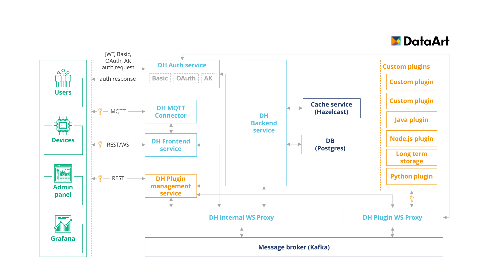

DeviceHive is a micro service-based system, built with high scalability and availability in mind.  
We understand that timeseries data (sensor data in our case) is always a challenge no matter what operations are taken on it. So we built a platform, which could not only listen to hundreds of devices simultaneously, but also scale to the required amount of instances in order to guarantee data safety and availability.

Let's take a look at the basic DeviceHive components:

# PostgreSQL

RDBMS storage is required to persist all meta information (cold data in terms of Lambda architecture). This includes data about devices, networks, users, device types and important configuration settings. In other words it's responsible for all non-time series data.

# Hazelcast IMDG

Storing time series data for a long period of time is not always required - usually it's a question of analytic jobs that deserve separate topic to discuss. At the same time immediate data access is always required (you probably don't want to wait couple of days before your smart lamp would react on your command). For these purposes Hazelcast IMDG is used. All notifications are saved to the distributed cache storage for a faster access and removed in 2 minutes by default (this limit can be changed, of course).

# Message Bus (Kafka)

Can you imagine Microservice architecture without a Message bus? Neither do we. That's why Kafka is here. It takes care of communication between services and balances load between them.

Why Kafka? It is fast, distributed, fault tolerant messaging system. It covers all our needs.  
But we understand that one day somebody may want to replace it with even faster or more lightweight solution. That's why decided not to use Kafka client libraries inside our services anymore (though RPC profile is still available, but it won't be supported in future releases). What we do use is **Websocket Kafka Proxy** - one more micro service, written in Node.js. It allows to be more flexible and not to commit to any message bus implementation. All services implement Websocket client API and don't rely on any specific Kafka methods or configurations.

# DeviceHive Frontend service

Service which provides RESTful and Websocket APIs. Responsible for primary checks, sending requests to Backend service and delivering response from it asynchronously. Also processes some lightweight calls to DB.

Detailed description of the API methods is provided in the following sections.

# DeviceHive Backend service

Responsible for storing data in Hazelcast, managing subscriptions and retrieving data by request from other services either from Hazelcast either form DB. Doesn't have publicly accessible API, all communication with it is made via Message Bus.

# DeviceHive Auth service

All authentication in DeviceHive is made by JWT tokens. They contain all information about user privileges, available devices, networks or device types. DeviceHive Auth service provides a RESTful API for generation, validation and refreshing these tokens.

Detailed description of the API methods is provided in the following sections.

# DeviceHive Plugin service (optional)

As was discussed in the previous section DeviceHive allows you to create small applications named **plugins**, that consume messages from it and do their own business logic.

To manage these apps DeviceHive Plugin management service was created. It is optional and requires one more **websocket proxy** - the one for **plugins** connectivity. When a user wants to register his or her own plugin, he/she should specify some querying parameters (what devices, networks or device types this plugin would be listening to). In response the address of the **websocket proxy** with the required JWT tokens should be returned. After a successful authentication all requested notifications would be pushed to the websocket session from the DeviceHive cloud.

In order to help you building your own plugins we created plugin templates in Node.js, Python and Java languages.

Detailed description of the API methods is provided in the following sections.

# MQTT plugin (optional)

DeviceHive also supports MQTT communication protocol by using specific naming for MQTT topics. This is required for pushing data to DeviceHive cloud. In case of using different naming conventions plugin will be used as an ordinary MQTT broker.

Detailed description of the API methods is provided in the following sections.
