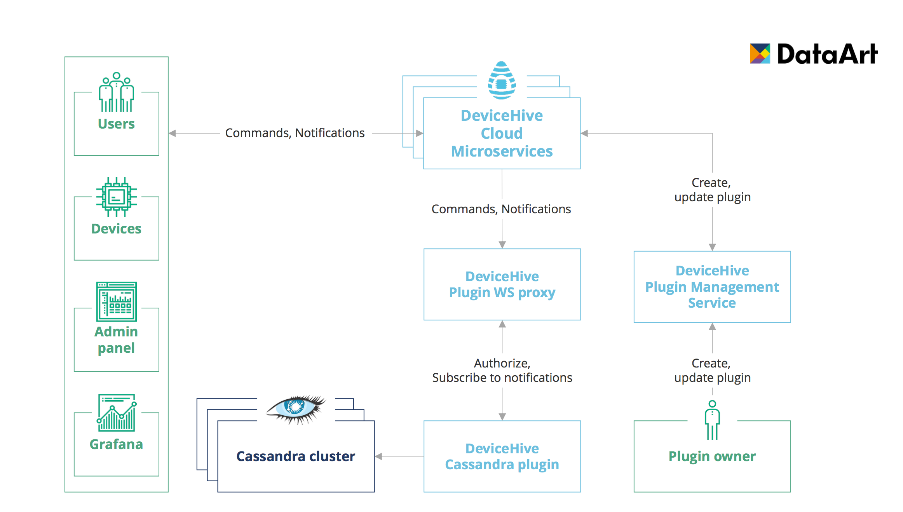

This plugin allows you to store commands and notifications obtained through the DeviceHive platform in Cassandra.

The application consists of 2 parts: the schema creation service and the plugin defined in the docker-compose file.

Upon starting the service the schema creation process will run first to create tables and UDT schemas from JSON and the plugin will check the state of the schema creation process using a predefined interval and number of checks. The schema creation service always must only work on one node. This was done to prevent concurrent schema modification that causes exceptions in Cassandra. But feel free to scale the plugin service as much as you need.

At the very beginning of runtime, both the plugin and schema creation service will compare the existent table and UDT schemas with what is defined in JSON. In case of a column/field mismatch, column/field type mismatch, primary and clustering keys mismatch, or ordering mismatch, the application will fail. In case a UDT or table already exists it will notify the user.

When the message arrives it can be either a command, command update or notification, depending on what type it is data will be inserted into the appropriate group of tables. Also, the data will be filtered to match the described table schema.

To learn how it works follow this [link](https://github.com/devicehive/devicehive-plugin-cassandra-node).
