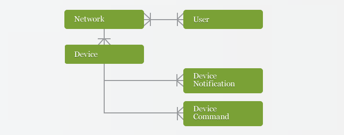

The DeviceHive API is the central part of the framework which allows different components to interact with each other. The API provides access to information about registered components in the system, and allows them to exchange messages in real time.

## Use Cases

There are three types of consumers of the DeviceHive API, as shown on the diagram below:

**Device**

Device is a unit that runs microcode, and it communicates with the API in the following cases:

- When started, device registers within the framework by passing unique identifier, display name and other meta-information.
- Device sends notifications with an arbitrary content format to notify other components about the changes in the device's environment.
- Device listens for commands issued by other components and executes them in an appropriate way.

**Client**

Client is an application that is used to monitor and/or control devices. It could be a user interface, or completely automated software that manages the entire device network. Clients may invoke the API in the following use cases:

- Client enumerates all the devices in the network, view their status and other meta-information.
- Client listens for device notifications and processes them in an appropriate way.
- Client sends commands to devices to trigger any logic on the device side.

**Administrator**

Administrator controls all aspects of the environment with the full access to the API. Commonly, administrators will need to use this API in the following cases:

- Administrator creates and manages API users (clients and other administrators).
- Administrator creates and manages device networks and associates users with them.
- Administrator monitors devices and all dispatched notifications and commands.

## Resources

The DeviceHive API is a RESTful service, which operates on several resource types. The diagram below reflects all used resource types and their relationships:

- [User](doc:user): represents a user with credentials and API access rights (client or administrator).
- [Network](doc:network): represents an isolation entity that encapsulates multiple devices with controlled access.
- [Device](doc:device): represents a unit that runs microcode.
- [Device Notification](doc:devicenotification): represents a message dispatched by devices for clients.
- [Device Command](doc:devicecommand): represents a message dispatched by clients for devices.
- [JSON Web Token](doc:authentication): represents an access key with specific API access rights.

## Server Processes

Besides the CRUD access to all resources listed above, the API includes several business features implemented on the server side. The sections below provide more information about their implementation.

**Message routing**

One of the primary features of the service is to connect devices with clients in real-time. This is achieved on the server-side by routing new commands and notification to their recipients with minimal delays.

There are three methods for API clients to receive incoming messages:

1. **Polling**: The client periodically requests the server to retrieve new [commands](https://docs.devicehive.com/docs/poll) or [notifications](https://docs.devicehive.com/docs/poll-1). The request must include the waitTimeout=0 parameter to disable waiting on the server.
2. **Long Polling**: The client makes request to the server, but the server responds only when a new message is available, or if the waiting timeout is expired (specified in the waitTimeout parameter). That approach is generally more efficient and minimizes message receive delays.
3. **WebSocket**: A separate WebSocket API allows clients to open persistent connections with the server, subscribe to particular commands or notifications and then receive messages from the server. The URL of the WebSocket endpoint could be retrieved using the [ApiInfo: get](https://docs.devicehive.com/docs/get) call.  
   In all three methods it's possible to specify the timestamp parameter as starting date/time (non-inclusive) for incoming messages. If that parameter is omitted, the server's current timestamp is taken instead.

In order to receive all messages in the right order, the clients should always pass the timestamp of the last received message when polling or subscribing. If no messages were ever received, the client should get the server's current timestamp using the [ApiInfo: get](https://docs.devicehive.com/docs/get) call and use it until a new message is received.

**Server-originated notifications**

Devices are not the only source of notifications in the system: the server also generates special notifications about various device events. The list below includes all such notifications with their description:

$device-add: Dispatched once for newly registered device. The notification includes all device properties specified during registration.  
$device-update: Dispatched every time device properties are updated (e.g. device name, status, etc.). The notification includes only the changed properties. If no properties were changed, the notification parameters property is an empty object.

## Authentication

Users are authenticated using [JSON Web Token](https://jwt.io/introduction/).

The access is provided based on authenticated user role (Client or Administrator) and provided access rights, please refer to the [Reference](doc:rest) for the list of available resources and methods for each user role.

## Response Codes

The API uses HTTP Status Codes to notify clients about the status of requested operation. As usual, the 2xx codes indicate the operation has been completed successfully, the 4xx codes indicate client errors, and 5xx codes reflect server errors.

The list below provides some additional information about common status codes returned by API operations:

- 200 OK: Requested operation completed successfully. The response body includes a resource object as specified in the API reference.
- 201 Created: Requested operation completed successfully and a new resource has been created (typically for POST operations). The HTTP Location header includes the URL of created resource. The response body includes created resource object as specified in the API reference.
- 204 No Content: Requested operation completed successfully and there is no resource in the response body (typically for DELETE operations).
- 400 Bad Request: The client did not specify all required parameters or some parameters passed are invalid. The response body includes a JSON object with the 'message' property describing the error details.
- 401 Unauthorized: The client did not specify authentication headers or access to the requested resource is not allowed for the current identity. The response body includes a JSON object with the 'message' property describing the error details.
- 403 Forbidden: The server could not complete the requested operation with the specified parameters (e.g. network with such name already exists). The response body includes a JSON object with the 'message' property describing the error details.
- 404 Not Found: The specified resource is not found. The response body includes a JSON object with the 'message' property describing the error details.
- 405 Method Not Allowed: The specified operation for the current resource is not allowed. The response body includes a JSON object with the 'message' property describing the error details.
- 500 Internal Server Error: The server error occurred while processing requested operation. The expected response format is not documented.
