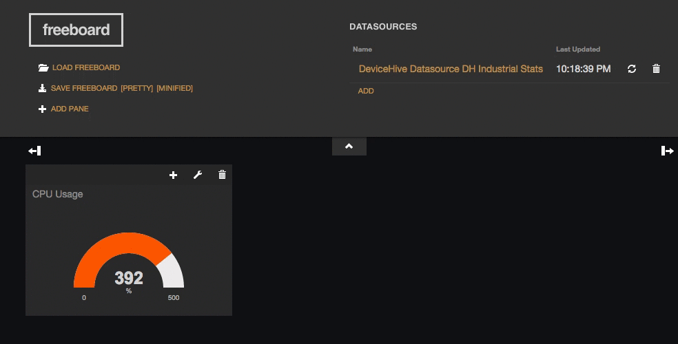
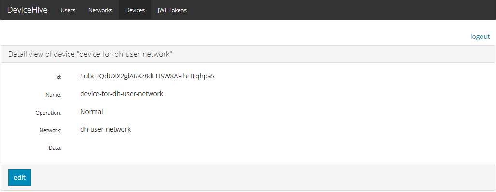
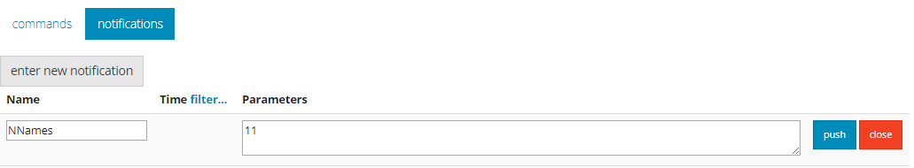
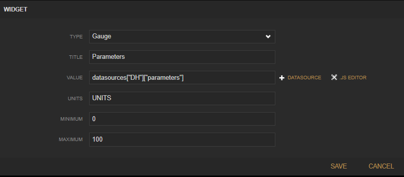
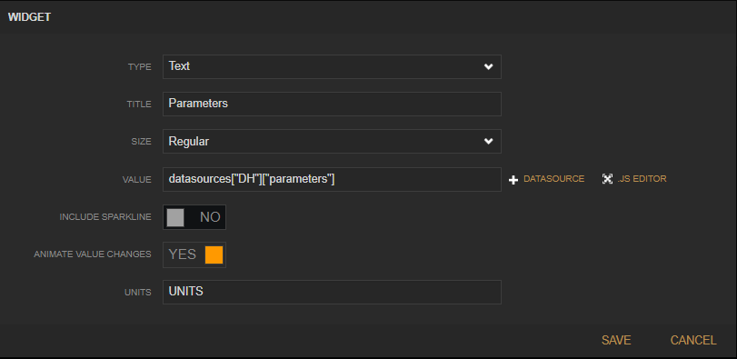
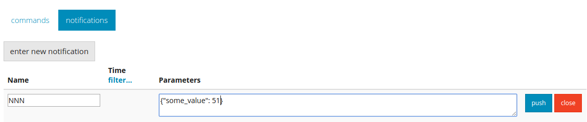
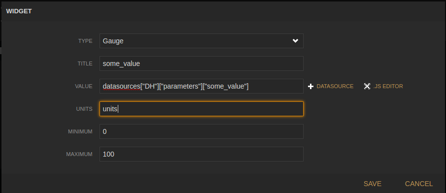
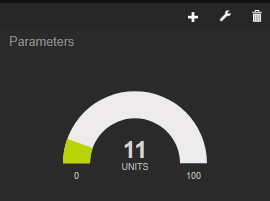
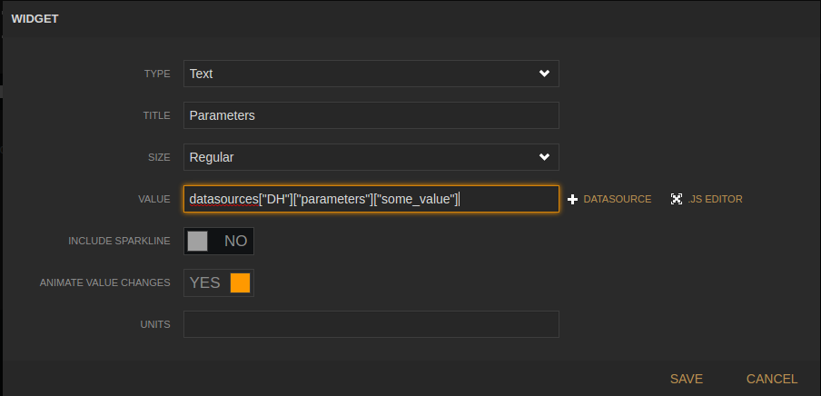
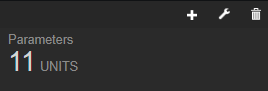

## devicehive-freeboard-datasource

[DeviceHive](http://devicehive.com) datasource plugin integrates your realtime device notifications with freeboard.

The plugin uses [DeviceHive JavaScript Library](https://github.com/devicehive/devicehive-javascript) to connect to the cloud instance. This means that both websocket and longpolling channels are supported and the final channel type will be determined based on your browser environment.

## Getting Started

Add a plugin to the freeboard [index.html](https://github.com/Freeboard/freeboard/blob/master/index.html) file as specified in [the doc](https://github.com/Freeboard/freeboard#testing-plugins) or use a devicehive freeboard fork with a pre-configured plugin - <https://github.com/devicehive/freeboard/>

Here is the script to install the latest version of the freeboard with the devicehive plugin on your local machine:

```text
git clone git@github.com:devicehive/freeboard.git
cd freeboard
git submodule update --init --recursive
```

If you want to use more stable version - checkout v1.1.0-dh branch. The full script looks as follows

```text
git clone git@github.com:devicehive/freeboard.git
cd freeboard
git checkout v1.1.0-dh
git submodule update --init --recursive
```

## Screenshots




## DeviceHive Datasource Setup

To add [DeviceHive](http://devicehive.com/) datasource click "Add" button under Datasources.

1. Select "DeviceHive" datasource type.

2. Enter the following parameters:

   2.1. Type: DeviceHive  
   2.2. Name: You can enter any name you like (e.g. 'DH')  
   2.3. Server API URL: Enter your [DeviceHive](http://devicehive.com/) Server.

Examples:

```
    2.3.1. For Playground use http://playground.devicehive.com/api/rest
    2.3.2. For Local Server use http://localhost:8080/dh/rest

2.4. JWT Token: Can be found on your [DeviceHive](http://devicehive.com/) Server, e.g. on [Playground Swagger JwtToken](http://playground.dev.devicehive.com/api/swagger.html?url=http://playground.dev.devicehive.com:80/api/rest/swagger.json#!/JwtToken/login)
2.5. DEVICE IDS: The list of devices, notifications from which will be shown. Device Id can be found in admin console - check the screenshot below. Hit Add button to enter several devices.
```

If left blank notifications for all devices will be visualized.



2.6. NOTIFICATION NAME: Notifications with the mentioned names only will be shown. Hit Add button to add several notification names.  
If left blank all notification names will be visualized.

## Widget setup examples

**Notification sample 1 (integer value)**



**Widget 1: setup and final look**




**Widget 2: setup and final look**




**Notification sample 2 (json object)**



**Widget 1: setup and final look**





**Widget 2: setup and final look**




