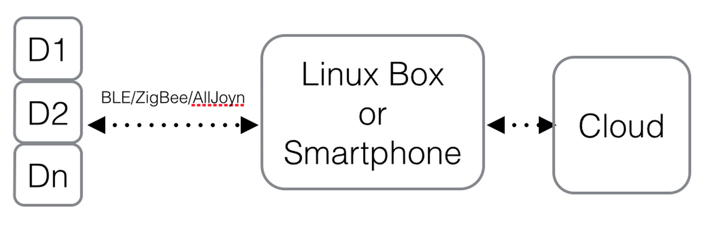
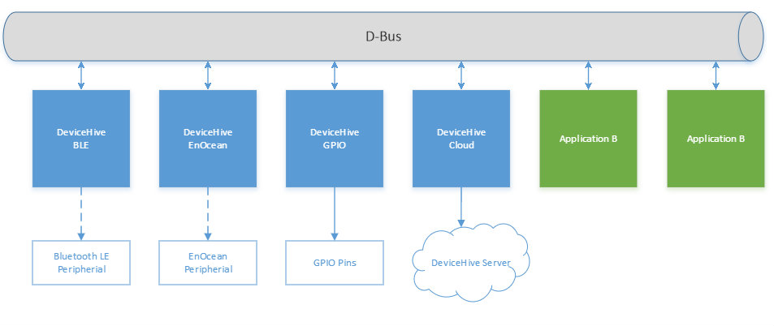

## Overview

Ever thought of developing connected devices using your favorite language: Go, Python, C/C++, Node.js, Java or maybe Bash? Ever thought of prototyping that on RasPi2, BeagleBone Black or anything that runs Ubuntu Snappy Core for IoT? Tired of using specific board and language just because it has better BLE or cloud libraries? Read on!

While developing IoT solutions we come across common tasks of connecting “things” to the cloud. For devices that are not connected to the cloud directly, gateways are used. Such gateway can be a system on chip (SoC) device: cable modem, set top box, home or industrial automation gateway, smart phone, home entertainment system, laptop or PC. All these gateway should have some sort of interface (BLE/ZigBee/etc radios, adapter, digital or analog inputs) that can connect to the actual device: lamp, controller, sensor, appliance. The picture below gives you an idea:



DeviceHive has an easy-to-use modular toolkit that allows you to interact with DeviceHive cloud and major protocols used in IoT. It’s not a library, it’s a service running on Ubuntu Snappy Core for IoT! This means you can interact with this service using your language of choice, as long as it has binding libraries for DBus, Linux standard message bus.  
##Ubuntu Snappy Core  
Raspberry Pi 2, Beagle Bone Black, x86 devices, can all run the same OS! Ubuntu Snappy Core.

Install Ubuntu Snappy Core on your favorite system: <https://developer.ubuntu.com/en/snappy/start/>  
Once Snappy is up and running on your device, install DeviceHive IoT Toolkit:  
For stable version of IoT Toolkit download snap from [releases page](https://github.com/devicehive/IoT-framework/releases)  
Copy it on your Snappy Device:

```
scp *.snap ubuntu@snappy-host:~
```

Install snaps using the following command:

```
sudo snappy install --allow-unauthenticated devicehive-iot-toolkit_1.0.0_multi.snap
```

If any issues occur during snaps install you can check syslog for details:

```
sudo tail -f -n 100 /var/log/syslog
```

Congratulations, now you can write apps that talk with BLE and DeviceHive Cloud using your favorite language.

## Connecting to DeviceHive Cloud (using Ubuntu Snappy)

Once IoT Toolkit is installed, first thing you want to do is try connecting to DeviceHive Cloud. Remember, cloud connector runs as a service (linux daemon) which means it takes care of connecting, re-connecting, authenticating and even throttling messages, providing you with easy to use DBus API which you can use from any language.

In order to connect to your instance of DeviceHive cloud, you should edit the config file. Example config file can be found here:

```yaml
URL: http://playground.devicehive.com/api/rest
AccessKey: AccessKeyExampleAccessKeyExampleAccessKeyEx=
NetworkName: Network XYZ
NetworkKey: XyzKey
DeviceID: my-snappy-gw
DeviceName: my-snappy-gw
DeviceKey: my-device-secret-key
DeviceNotifcationsReceive: WS
SendNotificatonQueueCapacity: 2048
LoggingLevel: info
```

You should provide correct `URL` and `AccessKey` for your device and save it as `~/config.yml` on Snappy device. To apply config run the following command:

```
# apply custom configwith server connection settings
sudo snappy config devicehive-iot-toolkit config.yml

# restart services to apply new settings
sudo snappy service restart devicehive-iot-toolkit
```

Check syslog to confirm that devicehive is using new config:

```
sudo tail -n 100 /var/log/syslog
```

## Other Platforms

Packages for other embedded linux platforms are coming soon.  
You also could build binaries from source code. In case of ubuntu all you need is Go 1.5.  
Go installation instructions you can find [there](https://golang.org/doc/install). [Great tutorial ](http://www.hostingadvice.com/how-to/install-golang-on-ubuntu/) how to use Go version manager also might be useful.

Once you have Go installed, just follow the instructions below:

```
go get github.com/devicehive/IoT-framework/devicehive-cloud
cd $GOPATH/src/github.com/devicehive/IoT-framework/devicehive-cloud
go install
```

to start devicehive-cloud run the following command:

```
sudo $GOPATH/bin/devicehive-cloud --conf=/path/to/conf.yml
```

Please note, it is not a service, it is just an application.

You can build and run other DeviceHive components (like devicehive-ble) in the similar way.

It is quite handy approach to start development your IoT solution using ubuntu instead of snappy linux. Once you finished all the stuff, you can create snappy package and upload it there as well.

## Architecture

As result, your IoT solution will have the following architecture:



DeviceHive BLE component will help you to communicate with devices through Bluetooth 4.0, also we provide components for AllJoyn and EnOcean devices. Using them you could connect those devices to Dbus, send and receive signals.

Now it is your turn to develop bridges between DH-components (transfer commands/notifications between your BLE-device and DH-cloud service).

You can find an example of such bridge [there](https://github.com/devicehive/IoT-framework/tree/master/examples/cloud-ble).

Enjoy!
