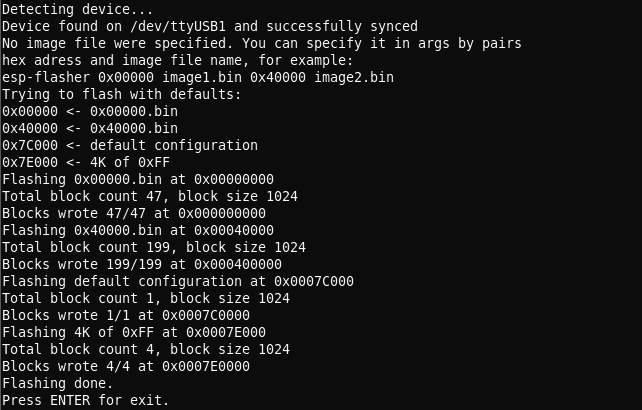
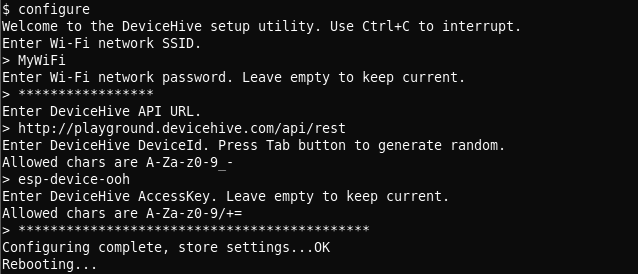
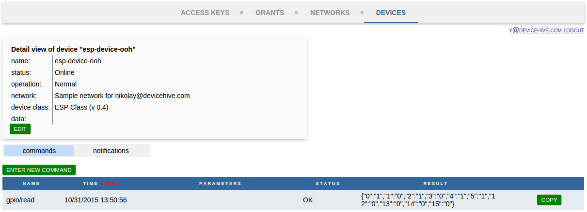

## DeviceHive Firmware for ESP8266 or how to Build a $5 Connected Device

We are happy to announce that a new version of the DeviceHive firmware for the ESP8266 chip has been released.

You can find the source code and the latest binaries here: <https://github.com/devicehive/esp8266-firmware>

Now you can:  
● Make pins work in the PWM (Pulse Width Modulation) mode. It's also possible to use it for the fixed period pulse generation;  
● Connect peripherals over UART;  
● Connect even more peripherals over I2C and some more interfaces.

We’ve prepared a small tutorial for getting started with our firmware. It's very simple, check it out below.

## Overview

The WiFi-enabled System on Chip, the ESP8266, comes in all forms and flavors: from maker friendly, easy to buy devices on [Adafruit](http://www.adafruit.com/product/2471) and [SparkFun](https://www.sparkfun.com/products/13678) to various $5 devices on Aliexpress and everything in between. The DeviceHive firmware turns it from a WiFi modem to a fully functional device, which can connect regular low-level peripherals: sensors, actuators, relays, LCD displays, to DeviceHive’s cloud service. Conveniently enough, with the DeviceHive firmware installed on an ESP8266 there is no need to write a code for an actual device — you have to flash it with the firmware once and configure it to work with your Wi-Fi network and your instance of the DeviceHive server. With a good degree of flexibility, you can make all device calls through the cloud API of the DeviceHive server, which can be deployed to your local network, a public cloud service. For the very beginning, you can use our free predeployed [playground](http://playground.devicehive.com) server.

Simply put, this firmware moves the most commonly used interfaces into a cloud service where you can control your devices or network of devices using the RESTful interface and your favorite language: JavaScript, Python, Java, Golang, or anything that has RESTful libraries. Or even simply with a curl command. This can be done through HTTP or Websockets.

A simple call from a browser to send bytes to a UART port of ESP8266 would look like this:

```javascript
var xmlhttp = new XMLHttpRequest();
xmlhttp.open('POST','http://exmaple.com/api/device/deviceId/command', true);
xmlhttp.setRequestHeader('Authorization', 'Bearer AccessToken='));
xmlhttp.setRequestHeader('Content-type', 'application/json;charset=UTF-8');
var myjson = {};
myjson['command"] = 'uart/write';
myjson['parameters'] = {'data':'SGVsbG8sIHdvcmxkIQ=='};
xmlhttp.send(JSON.stringify(myjson));
```

After receiving this command the chip prints 'Hello, world!' to the UART bus. The similar code can be used for GPIO, or I2C.

## Getting Started

First of all, the firmware has to be flashed into the chip memory and the chip has to be configured for using a specified Wi-Fi network, and the DeviceHive server. Developers can build the firmware and all the tools required for flashing and configuring by themselves from the sources. Or it can be downloaded from a Git repository: go to <https://github.com/devicehive/esp8266-firmware/releases> and download the archive with the latest version.

After assembly, connect it to computer. Install a driver for your USB->UART converter. The most popular chip and official sites with drivers are listed below:

- CP210x: <http://www.silabs.com/products/mcu/pages/usbtouartbridgevcpdrivers.aspx>
- PL230x: <http://www.prolific.com.tw/US/ShowProduct.aspx?pcid=41>
- FTDI: <http://www.ftdichip.com/Drivers/VCP.htm>
- CH341: <http://www.wch.cn/index.php?s=/page-search_content-keyword-CH341SER.html>

Make sure that a virtual serial port is available in your system (a virtual COM port is presented in Windows, '/dev/ttyUSB*' in Linux, '/dev/tty.*' in OS X). Unpack the archive with the firmware and flash it running 'esp-flasher' in your terminal. The flash program automatically detects a serial port and uses the '0x00000.bin' and '0x40000.bin' files for flashing. The successful flash output is below:



Sometimes when flashing a device you may receive a “Wrong answer” error — just reset the device and try re-flashing again. You might also want to make sure the device is plugged into a breadboard, or try holding it and flashing it while the pins are not touching anything.

Now remove the wire from GPIO0 (let it sit away from any pins or connect it to the “high” pin), reboot the device and connect to the firmware using the 'esp-terminal' utility. You can also use any other utility that can connect to a terminal via UART and supports escape sequences, PuTTY or GNU 'screen' for example. The port parameters are: 115200 8N1.

The firmware terminal is a UNIX like terminal with a few commands. It exists for chip configuration and debugging. To see the debug output type 'dmesg'. To configure it run the 'configure' command. Follow the instructions displayed in the terminal. You need to know the DeviceHive server credentials in order to configure it.

To get started you can use DeviceHive’s free playground located here: <https://playground.devicehive.com.> After registration you will have your own DeviceHive server instance. The DeviceHive server can be deployed to a local network or to some cloud hosting services. Follow the DeviceHive server deployment instructions [here](doc:deployment-with-docker) or [here](doc:server-installation).

A configuring sample is below:



After rebooting the device you can send commands to the DeviceHive server and the ESP8266 will perform them. You can use the DeviceHive web admin control panel to send a command for test purposes or learning. Go to the web admin, 'Devices' tab -> 'commands' subtab -> 'enter new command'. Type a command and parameters and press 'push'. After the ESP8266 performs your command you can press the 'refresh' button to see the result. For example, the 'gpio/read' command would look in the admin control panel like this:



Now you can start writing your own program to create your own IoT devices with your favorite language and frameworks using the DeviceHive [REST API](doc:rest) which can be transmitted with HTTP(S) or Websockets. A list of accepted command for the ESP8266 is provided in the document at the link below.  
<https://github.com/devicehive/esp8266-firmware/blob/develop/DeviceHiveESP8266.md>
