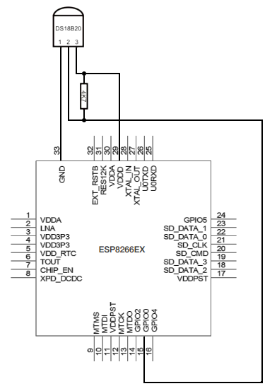
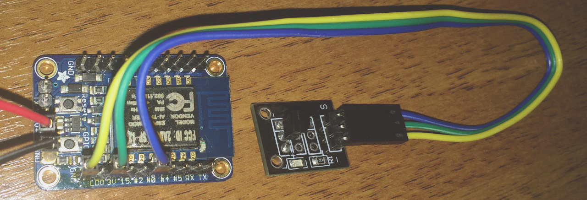
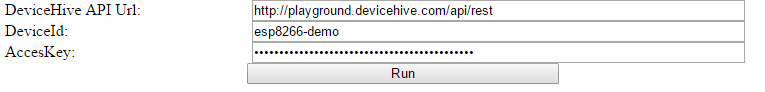
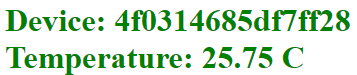

One of the most efficient, easy and the cheapest way to connect DS18B20 temperature sensor to cloud service is DeviceHive firmware for ESP8266. This tutorial describes how easily it is possible to do.

## 1. Prepare you ESP8266 chip

Install DeviceHive firmware and configure your DeviceHive server credentials. Follow this [tutorial](chip-in-the-cloud-esp8266#getting-started). If chip was flashed and configured for using with DeviceHive before, there is no need to do it again. Just skip this step then.

## 2. Connect sensor to chip

Connect DS18B20 to your chip as on circuit diagram below:

Sensor is powered from the same source as chip. Sesnor output is connected to GPIO0 pin. Resistor is 4.7k Ohm or so. There is no need to use resistor if wires are short because chip also pulls up line. Sample circuit implementation with [Adafruit HUZZAH ESP8266 Breakout board](https://www.adafruit.com/product/2471) and DS18B20 breakout board:

## 3. Start cloud client

Download [this html file](https://github.com/devicehive/esp8266-firmware/blob/develop/examples-cloud/ds18b20-onewire.html) (right click on 'Raw' button, 'Save link as...'). Open it in your browser (except Firefox, it has disabled cross domain requests from local file by default) and set up your server credentials:

Click on 'Run' button and you will get continuously updating temperature data and DS18B20 address as screenshot below:

Hardware connectivity is easy with DeviceHive, isn't it? Stay tuned!
