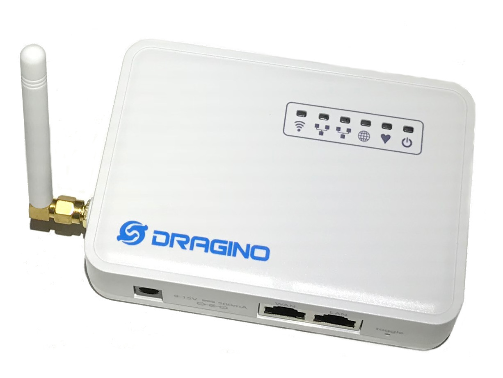
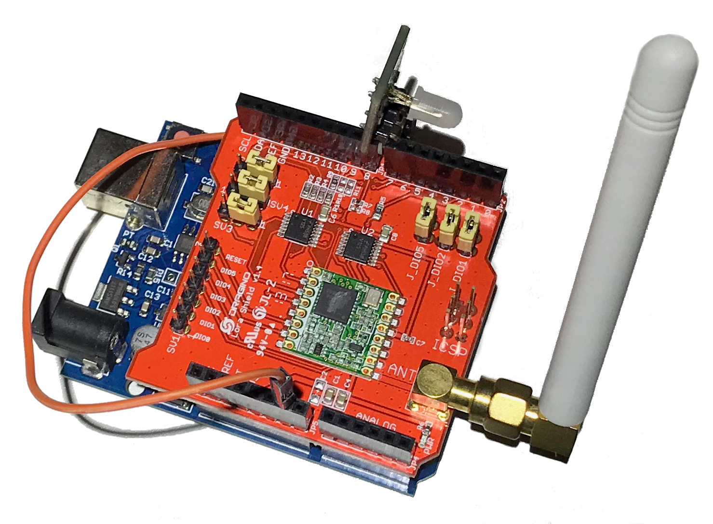
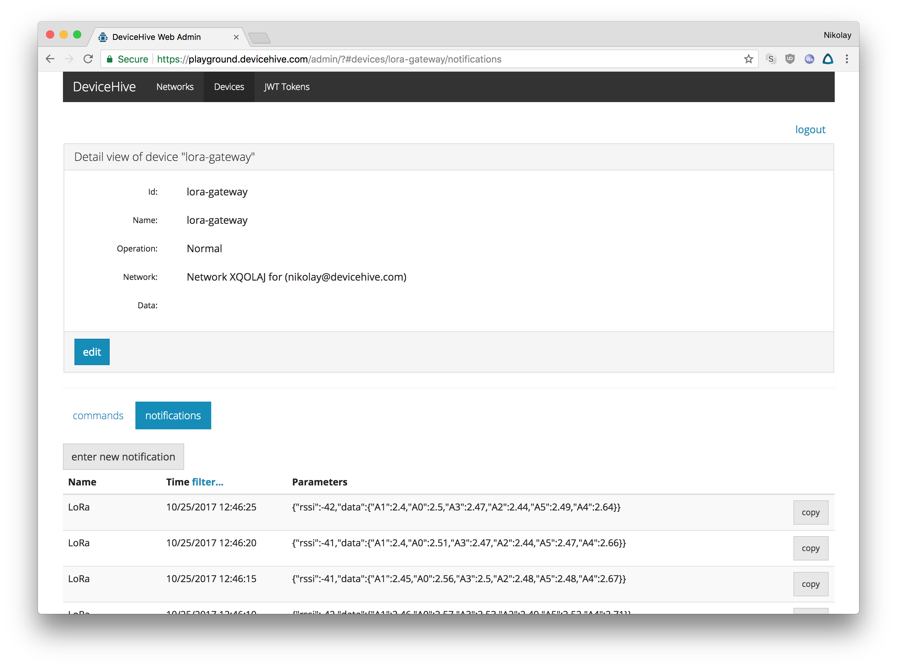
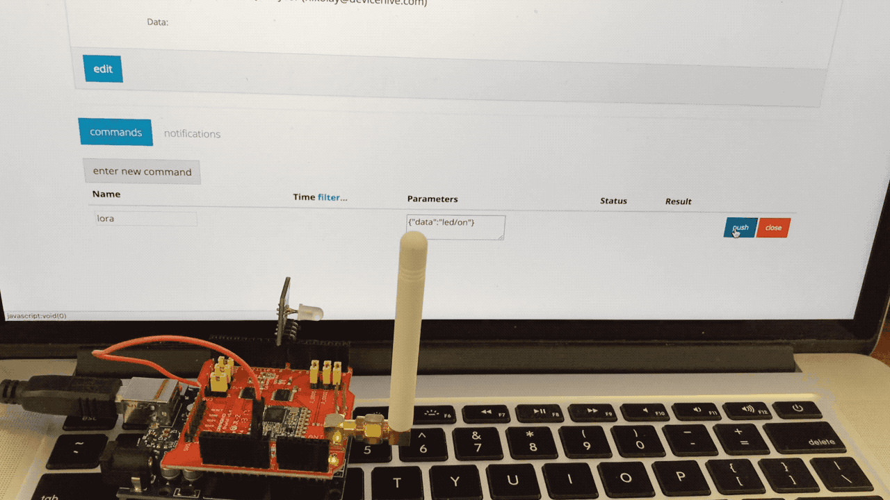

LoRa is a [chirp spread spectrum (CSS)](https://en.wikipedia.org/wiki/Chirp_spread_spectrum) radio modulation technology which allows transmitting data over long distances with low power consumption. This technology is a perfect fit for communication with simple sensors across a local area like an industrial or agricultural zone. Low power consumption allows building battery-powered devices, which can operate for months or even years using a single battery. Therefore, such devices can be installed without any infrastructure, i.e. totally wirelessly.  
Of course, in some cases, it might be sufficient to set up communication solely between devices. However for the majority of situations, a real IoT platform is required to manage devices and to store and analyze data. Communication between such devices requires an IoT gateway which are also called "edge devices". Such gateways receive data from a wired or wireless protocol and sends data to an IoT cloud service where the real magic with data is happening.  
DeviceHive has an out-of-the-box solution to deploy such gateways for your LoRa devices. [Dragino LG01](http://www.dragino.com/products/lora/item/117-lg01-p.html), the most widely spread and commercially available hardware for software gateway implementation, was chosen as a reference.



# DeviceHive Gateway Installation

Installation of the gateway requires firmware version 4.3 or newer. Firmwares are available on the [official site](http://www.dragino.com/downloads/index.php?dir=motherboards/ms14/Firmware/IoT/).  
Configure the Internet connection on the gateway with a standard Web Interface. Connect to the gateway using SSH (default user name/password are root/dragino).  
Now follow the next steps to install the DeviceHive LoRa gateway:

- Install DeviceHive Python library to the gateway:

```bash
curl -SL https://github.com/devicehive/devicehive-python/archive/2.1.0.tar.gz | tar zx
cd devicehive-python-2.1.0/
python setup.py install
cd ..
rm -rf devicehive-python-2.1.0/
```

- Copy the gateway package:

```bash
mkdir -p /opt/devicehive
curl -SL https://github.com/devicehive/lora-gateway/releases/download/v0.0.2/gateway.tar.gz | tar zx -C /opt/devicehive
```

- Flash microcontroller part of the gateway:

```bash
/opt/devicehive/gateway.py install
```

Now the DeviceHive gateway is installed and should start automatically on each boot. In a few seconds an additional web interface will appear on port 8000. Go there with a web browser and configure the gateway.

[block:image]
{
"images": [
{
"image": [
"images/79aaf57-Screen_Shot_2017-10-18_at_19.44.08.png",
"Screen Shot 2017-10-18 at 19.44.08.png",
808
],
"sizing": "80"
}
]
}
[/block]

That is it. The gateway is ready for transmitting data between LoRa and the DeviceHive server!

# Simple LoRa Device

To demonstrate how the gateway works there is a simple Arduino-based device in the [repo](https://github.com/devicehive/lora-gateway/tree/master/lora-demo-device). It can be run with an Arduino Uno board and [Dragino Lora Shield](http://www.dragino.com/products/module/item/102-lora-shield.html). This shield is based on [HopeRF RFM95W](http://www.hoperf.com/rf_transceiver/lora/RFM95W.html) module. Also it requires additional LED connected to digital pin #7.



Connect this board to a laptop or desktop with USB and flash [sketch](https://github.com/devicehive/lora-gateway/blob/master/lora-demo-device/lora-demo-device.ino) with Arduino IDE. Leave this board powered up.

This simple device reports the state of the analog pins every 5 seconds and can also control the connected LED. Let's see how to control it with DeviceHive through the gateway. Go to the server admin console, which is used while configuring gateway. Open the `Devices` tab, find your DeviceID in the list, and open it. Go to the `Notifications` tab. So, here it is, you may observe notifications from board with their analog pin states on the server.



To send data in another direction, go to `Commands` tab, create a new command named 'lora' with the parameters '{"data":"led/on"}' and send it. Your LED should light up.



In the same way your LED can be turned off with the 'led/off' data field.

# Conclusion

Instead of an Arduino demo board, any LoRa device can be used and the DeviceHive gateway provides transparent communication between LoRa radio and cloud service. This allows building IoT devices using highly efficient and power saving radio technology.
