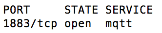
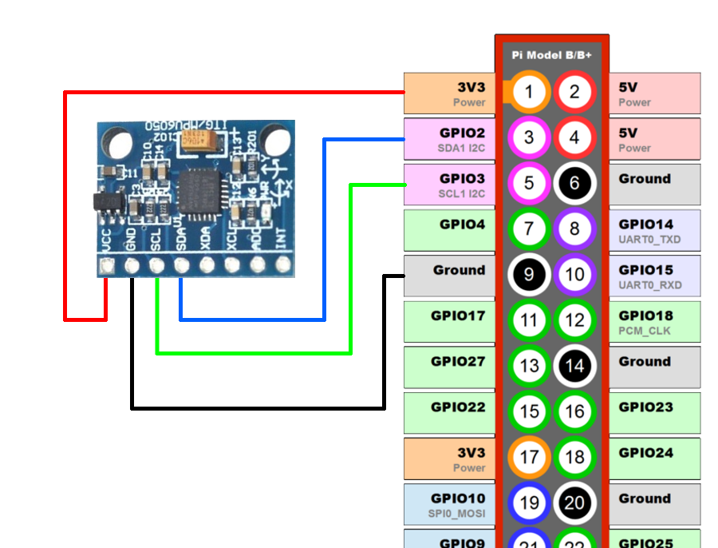
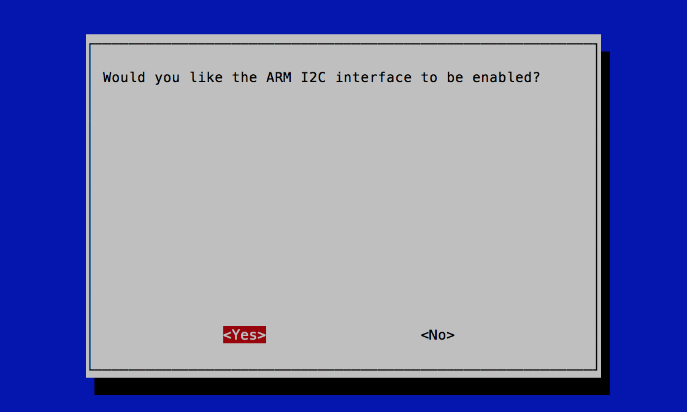
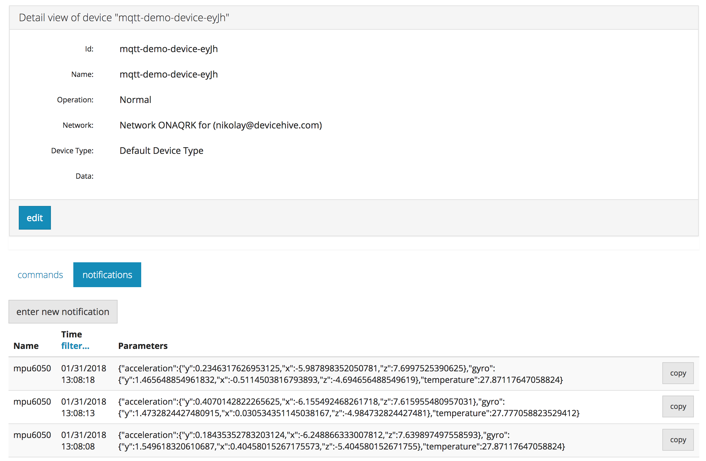

Since DeviceHive has a MQTT endpoint, it supports the connection of any MQTT device to the server. This endpoint uses a standard MQTT over TCP connection and allows connecting to the server using a standard MQTT library. In this tutorial we will implement a simple accelerometer, gyroscope and temperature monitor device using a MPU6050 sensor, Raspberry Pi 2 or 3 and Python's Eclipse Paho MQTT library to send data to the cloud.

## Server prerequirements

As MQTT support is optional for DeviceHive server installation, you may find it either enabled or disabled for your server instance. The simplest way to check it is to test whether port 1883 is available on server:

```shell
sudo nmap -p 1883 -sS some-server.example.com
```

Here's how available port would look like in the terminal output:



You can always deploy new instance of DeviceHive with MQTT support using [this manual](https://github.com/devicehive/devicehive-docker/blob/master/rdbms-image/README.md). Basically, you just need to add

```shell
COMPOSE_FILE=docker-compose.yml:mqtt-brokers.yml
```

to your .env file during deployment.

## Configuring Raspberry Pi

First of all we need to connect MPU6050 sensor to Raspberry Pi. That is very easy since it uses I2C bus and only 4 wires are required. The circuit diagram for this connection is shown on the image below:



MPU6050 uses I2C interface, however Raspbian OS doesn't have enabled I2C interface by default. So let's enable it. To do that, connect to Raspberry Pi via SSH and run configuration util.

```shell
sudo raspi-config
```

Go to 'Interfacing Options' -> 'Interfacing Options' -> 'I2C' and enable it in this dialog.



Reboot your board. SSH there again and install dependencies:

```shell
sudo apt install python-smbus
sudo pip install mpu6050-raspberrypi paho-mqtt
```

## Running demo

Download our [sample](https://gist.github.com/Nikolay-Kha/c07243c838a74ed0c9a2305d29560f97):

```shell
wget https://gist.github.com/Nikolay-Kha/c07243c838a74ed0c9a2305d29560f97/raw/ba86f63ade9f7b4e60a43927081597d5c2dd03c5/demo.py
```

Open it with 'nano' or 'vim' editor and edit line 9-10 with your server address and access token. Now we are good to go - feel free to run it:

```shell
python demo.py
```

Go to server's admin console and you will see notifications with sensor data every 5 seconds like on this screenshot:



## How it works

[block:html]
{
"html": "<script type=\"text/javascript\" src=\"https://ajax.googleapis.com/ajax/libs/jquery/1.9.1/jquery.min.js\"></script>\n<script type=\"text/javascript\" src=\"https://cdnjs.cloudflare.com/ajax/libs/gist-embed/2.7.1/gist-embed.min.js\"></script>"
}
[/block]

This demo uses MQTT protocol to connect to server. [The Eclipse Paho MQTT library](http://www.eclipse.org/paho/) is used on the hardware side. Whole server connectivity and hardware handling takes around 100 lines of code. Let's break down the main parts to see how it works.

Import library:

[block:html]
{
"html": "<code data-gist-id=\"c07243c838a74ed0c9a2305d29560f97\" data-gist-line=\"7\"></code>"
}
[/block]

Connect with the library to MQTT endpoint and set callback functions:

[block:html]
{
"html": "<code data-gist-id=\"c07243c838a74ed0c9a2305d29560f97\" data-gist-line=\"47-52\"></code>"
}
[/block]

When library is connected to the server, application starts interacting with the server by sending DeviceHive requests and handling responses from these requests. Our first request is an authorization request. Until we become authorized, any other API is not available. So it sends in MQTT topic 'dh/request' JSON with action 'authenticate'. Response will be published in MQTT topic 'dh/response/authenticate@deviceid' (where deviceid is an actual deviceid of your device on DeviceHive server). In the same way other requests can be performed. Full documentation of using MQTT topics in DeviceHive is [here](https://github.com/devicehive/devicehive-mqtt/blob/master/README.md). Authentication request and response topic subscription in our code looks like:

[block:html]
{
"html": "<code data-gist-id=\"c07243c838a74ed0c9a2305d29560f97\" data-gist-line=\"56-61\"></code>"
}
[/block]

Afterwards we handle a response. When authentication is successfully completed, demo sends 'device/save' requests to make sure that device exists on the server, or create a new one otherwise. Also it subscribes to notification insert responses just to check whether notifications are successfully sent.

[block:html]
{
"html": "<code data-gist-id=\"c07243c838a74ed0c9a2305d29560f97\" data-gist-line=\"63-72\"></code>"
}
[/block]

Further on, demo reads sensor data (or emulated data, if demo was started on PC) every 5 seconds and sends this data to the server (which we observed via server admin console in previous section):

[block:html]
{
"html": "<code data-gist-id=\"c07243c838a74ed0c9a2305d29560f97\" data-gist-line=\"95-109\"></code>"
}
[/block]

## Conclusion

DeviceHive has the ability to use the MQTT protocol and that means any device with MQTT support can be connected in a simple way. It also allows using a wide range of open source MQTT libraries for various programming languages and using the whole DeviceHive platform infrastructure within your projects.
