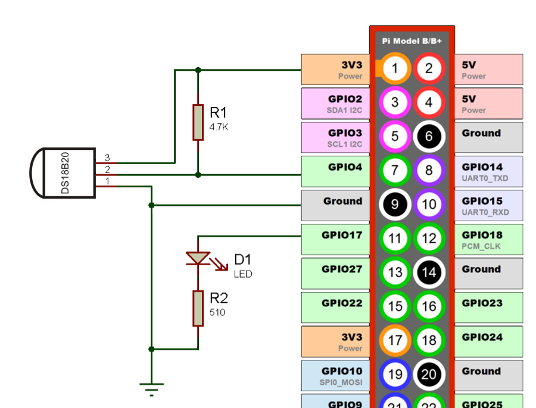
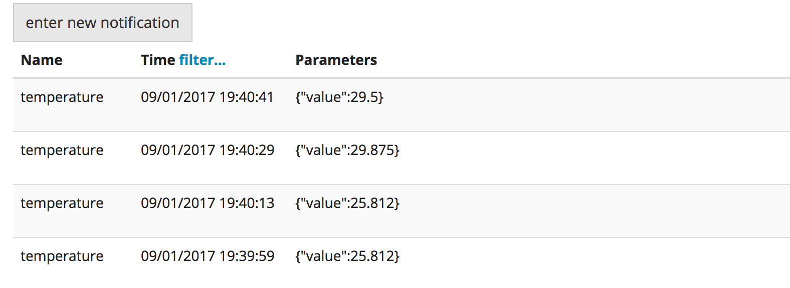
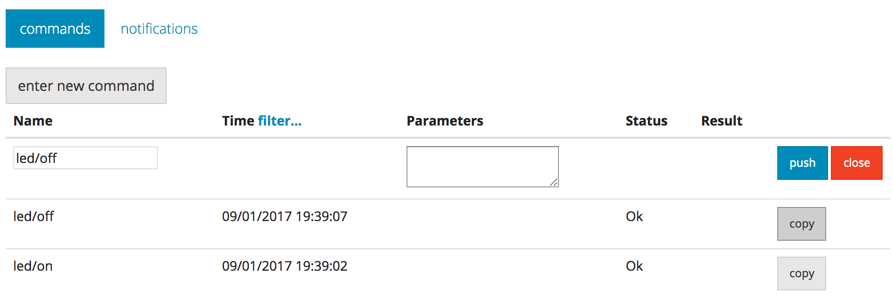

DeviceHive is powerful and yet easy. To make it even easier to understand, let’s take this simple example of the fun project that you can build in just a few hours. How about building a remote temperature sensor and a remotely controlled LED? This can be a very good starting point to build from. It involves replacing LED with power relay and controlling light in your room, adding humidity sensors and, say, light sensors to better monitor the environment and report everything on your mobile device.

This sample can work on virtually any embedded linux board that has (1) python (2) 1-wire kernel drivers.

In order to do this, you will need:

- [Rasbperry Pi 1 Model B, 2 or 3](http://raspberrypi.org) or any other inexpensive Embedded Linux development board, like orange pi, odroid, or beaglebone.
- Dallas 1-wire temperature sensor: DS18B20 – available everywhere :-).
- Any LED.
- 510 ohm resistor for LED and 4.7K ohm (or so) resistor for DS18B20.
- Breadboard.
- The schematic is as follows, the sensor will be powered from RasPi’s Pin 1. No external power needed:



The following steps will turn all of the above into a remotely controlled Internet connected device.

## Configuring Raspberry Pi

1. Download SD card image of [Raspbian](https://www.raspberrypi.org/downloads/) and expand it onto an SD card.
2. Find a reliable power supply – Micro-USB smartphone chargers are usually a good choice. It should be capable of supplying 5V up to 1A.
3. You don’t have to use HDMI display and USB keyboard – you can connect it to your laptop or network using Ethernet and let RasPi obtain the DHCP address and connect to it using SSH using pi/raspberry as login/password.  
   The latest Raspbian images have SSH disabled by default. To enable SSH without connecting monitor and keyboard insert microSD card into your reader and create empty file named `ssh` in the root of `boot` partition.
4. Connect LED/Sensor as shown on Figure 1 above.
5. Enable 1-wire kernel modules that come pre-installed but not enabled: `echo "dtoverlay=w1-gpio" | sudo tee -a /boot/config.txt` and reboot `sudo reboot`. If you have OS which was released before January of 2015 (kernel older then 3.18) then run `sudo modprobe w1-gpio && sudo modprobe w1_therm`.
6. Find your sensor: ls /sys/bus/w1/devices/ it should look like 28-00000393268a
7. Test the sensor by printing its output: cat /sys/bus/w1/devices/28-00000393268a/w1_slave  
   Sample output:

```bash
pi@raspberrypi:~ $ cat /sys/bus/w1/devices/28-0314685df7ff/w1_slave
8f 01 55 00 7f ff 0c 10 a0 : crc=a0 YES
8f 01 55 00 7f ff 0c 10 a0 t=24937
```

## Installing DeviceHive on Raspberry Pi

1. Connect to your RasPi using ssh or open terminal using monitor and keyboard.
2. Download the latest version of DeviceHive Python library:

```bash
sudo pip install devicehive
```

3. Copy this example:

```bash
wget https://github.com/devicehive/devicehive-python/raw/stable/examples/raspi_led_thermo.py
```

4. Open downloaded file 'raspi_led_thermo.py' with nano or vi editor and change 'SERVER_REFRESH_TOKEN' variable with your correct refresh token(you can get it in Admin UI).
5. Run the script: `python raspi_led_thermo.py`

## Access your device

1. After the first run of the script, you can see the device and the readings from the sensor in Admin UI. Go to the Devices tab, and click “detail” for your device, then go to “notifications”.



2. You can also send on/off messages to the LED. Go to “commands” for your device, click “enter new command”, set the name as `led/on` to turn on LED, then click “push”. The LED will turn on. Guess how to turn it off. ☺



With the same [DeviceHive Python library](https://github.com/devicehive/devicehive-python) client application which would switch LED or monitor temperature can be implemented. DeviceHive also has a bunch of libraries for other programming languages, you will find all of them [here](https://github.com/devicehive). Even if there is no suitable library you can always use simple RESTful calls described [here](get-started).

Congratulations! You are done. Your internet-enabled temperature sensor and LED are now talking to your with DeviceHive cloud service. You just saved yourself a bunch of time designing the protocol, implementing libraries, troubleshooting and deploying. Well done! Now go and innovate.
