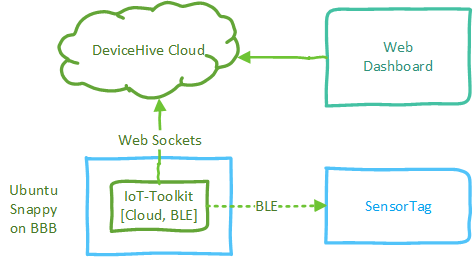
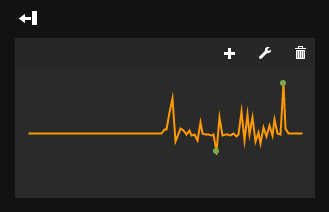
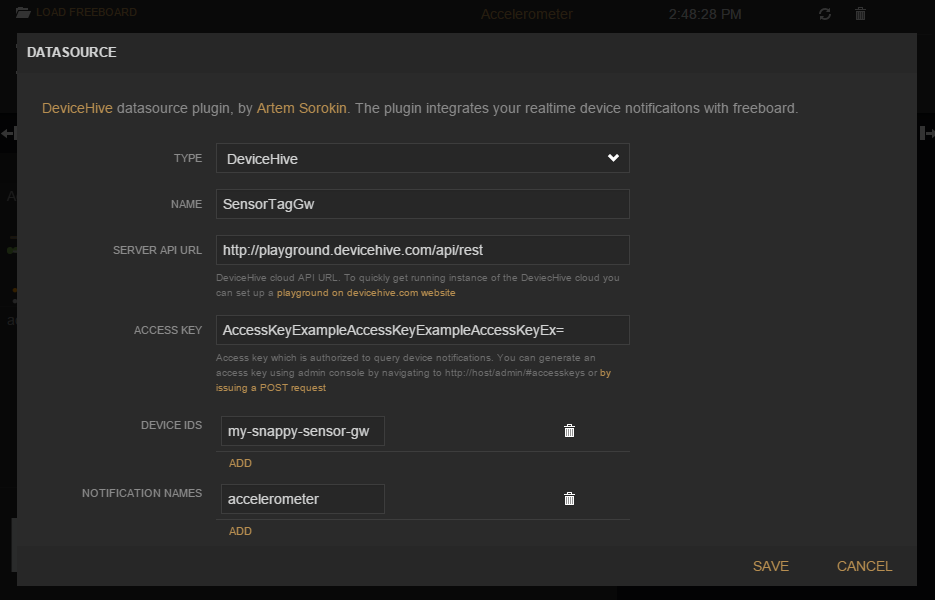
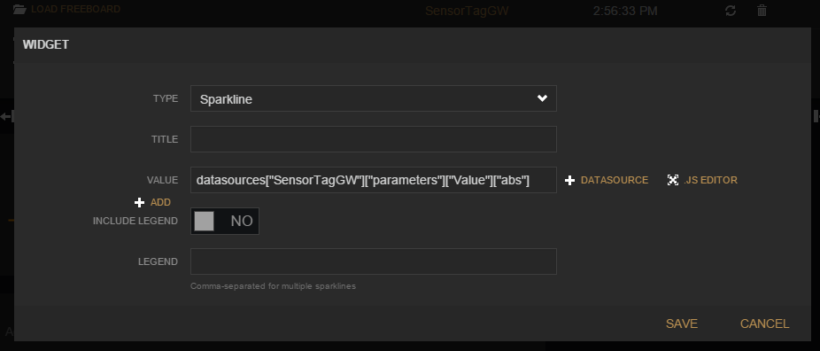

Connecting real world objects to the Internet is what defines IoT. Very often it is needed to remotely monitor the environment or state of the object. There are many ways to do that, but one of our favorites is to use Texas Instruments [Simplelink SensorTag](http://www.ti.com/sensortag) and BeagleBone Black [BBB](http://beagleboard.org/BLACK) connected to DeviceHive IoT platform.

This is where DeviceHive Cloud and [IoT Toolkit](doc:iot-toolkit-overview) help come to rescue. Paired with SensorTag and widely available affordable linux-based gateways it you can get a working prototype in minutes.

[block:image]
{
"images": [
{
"image": [
"images/rJnY3ZyNT2qWZ97MCFg3_SensorTag2-crop.jpg",
"images/OhapgZ5NRwWQ1xMwc2bO_SensorTag2.jpg",
"SensorTag2-crop.jpg"
],
"caption": "CC2650 SensorTag"
}
]
}
[/block]

Below is a quick diagram of what the solution will look like under the hood. Now let's go into the details.



With a little bit of DeviceHive magic, in the end of this exercise we'll get a nice web-based chart of SensorTag's motion:



Now, let' get started!

## Components & Prerequirements

We are going to use the following equipment:

- [Beagle Bone Black](http://beagleboard.org/black) - you can also use Raspberry Pi2
- [Bluetooth 4.0 Low Energy USB Adapter](http://www.amazon.com/gp/product/B00HQCINKE?psc=1&redirect=true&ref_=oh_aui_search_detailpage) - you can use any other Bluetooth 4.0 Low Energy adapter
- [CC2650 SensorTag](http://www.ti.com/ww/en/wireless_connectivity/sensortag/) - you can also use older [CC2541 SensorTag](http://www.ti.com/tool/cc2541dk-sensor)

For the cloud part we are going to use [DeviceHive Playground](doc:devicehive-playground):

- Please signup on <http://playground.devicehive.com> or check documentation page for signup instructions.
- Once registered, note down API Access Key and REST API url and try it with curl as suggested on a login page.

Our Linux gateway will be running [Snappy Ubuntu Core](https://developer.ubuntu.com/en/snappy/) so please follow [official documentation](https://developer.ubuntu.com/en/snappy/start/#try-beaglebone) on how to get latest Snappy installed.

> 🚧 Please read carefully on how to bypass original bootloader on BBB

Please make sure Bluetooth 4.0 Low Energy USB Adapter is plugged into your Linux gateway device before running samples from this tutorial.

[block:image]
{
"images": [
{
"image": [
"images/ZHDxR1TSQO2u0LfH9WLZ_small.jpg",
"small.jpg",
"800"
],
"caption": "Beagle Bone Black"
}
]
}
[/block]

## Installing and Configuring IoT-Toolkit

[DeviceHive IoT Toolkit](https://github.com/devicehive/IoT-framework) is an Open Source set of services that allow you to quickly connect to basic IoT devices and cloud giving you an easy to use [D-Bus](http://www.freedesktop.org/wiki/Software/dbus/) based API which can be used from any programming language that has D-Bus bindings: Python, Go, JavaScript, C/C++ etc. currently supports: Bluetooth Low Energy, DeviceHive cloud, AllJoyn, GPIO and more.

DeviceHive IoT-Toolkit is available as a Snap for the Snappy Ubuntu Core. You can download a precompiled version of binaries from [releases page](https://github.com/devicehive/IoT-framework/releases):  
[devicehive-iot-toolkit_1.0.0_multi.snap](https://github.com/devicehive/IoT-framework/releases/download/1.0.0/devicehive-iot-toolkit_1.0.0_multi.snap)  
[sensortag-cloud-demo_1.0.0_multi.snap](https://github.com/devicehive/IoT-framework/releases/download/1.0.0/sensortag-cloud-demo_1.0.0_multi.snap)  
You can also build it for your favorite distribution of Embedded Linux.

Before installing the Snap, DeviceHive IoT Toolkit's cloud connector config.yml needs to be configured with AccessToken and Network Information from playground website as well as unique values for device id, name, key (do not use the default values from the example below with public playground, make sure to use something unique).

```yaml config.yml
URL: http://playground.devicehive.com/api/rest
AccessKey: AccessKeyExampleAccessKeyExampleAccessKeyEx=
NetworkName: Network XYZ
NetworkKey: XyzKey
DeviceID: my-snappy-sensor-gw
DeviceName: my-snappy-sensor-gw
DeviceKey: my-device-secret-key
DeviceNotifcationsReceive: WS
```

Copy Snap files and config.yml to the device using scp and SSH into your device:

```shell
scp *.snap ubuntu@your-device-ip:~
scp config.yml ubuntu@your-device-ip:~
ssh ubuntu@your-device-ip
```

> 📘 Knowing your device IP address
>
> To get your device IP address you can look into router DHCP table or use tool like nmap to scan available computers with open ssh port, for example assuming your computer is on 192.168.0.0/24 network:  
> nmap -p 22 -T4 -O --open 192.168.0.0/24

> 📘 Default credentials
>
> Snappy Ubuntu Core uses the following ssh credentials by default: ubuntu/ubuntu

Once you SSH'ed into device, use the following command to install and configure DeviceHive snap:

```shell
# install allowing usage of unsigned snaps
sudo snappy install --allow-unauthenticated devicehive-iot-toolkit_1.0.0_multi.snap

# apply custom configwith server connection settings
sudo snappy config devicehive-iot-toolkit config.yml

# restart services to apply new settings
sudo snappy service restart devicehive-iot-toolkit
```

Now install sensor tag sample application that will connect BLE SensorTag to DeviceHive cloud:

```text
sudo snappy install --allow-unauthenticated sensortag-cloud-demo_1.0.0_multi.snap
```

> 📘 Troubleshooting
>
> Note, that you can monitor system and snappy services logs using syslog:  
> sudo tail -f /var/log/syslog

Now that the gateway is ready sensortag-cloud service will be running continuously as daemon and connecting to every SensorTag that it can discover and publishing accelerometer readings to your playground. You can ensure scenario is working by watching log on the device as mentioned above and/or checking notifications tab on playground admin console.

## Visualizing Sensor Data

Let's display sensor data in the online dashboard. DeviceHive Playground comes with a nice addition of a hosted version of [Freeboard](https://github.com/devicehive/freeboard) with [DeviceHive DataSource Plugin](https://github.com/devicehive/devicehive-freeboard-datasource) installed. It can be accessed from your [Playground Page](http://playground.devicehive.com/dashboard) ('Dashboard' link).

1. Click on [ADD] button in `DATASOURCES` section.
2. In the `Type` dropdown select `DeviceHive`.
3. Provide some `Name` and verify that `Server API Url` and `Access Key` do match the information provided on your Playground.
4. Add Device ID that was provided in the config.yml to the toolkit snap.
5. Add `accelerometer` as notification name.
6. Click SAVE.



Now add widgets with visualizations:

1. Click [ADD PANE] and Click + icon on the new panel.
2. Select `Sparkline` as Widget Type.
3. Choose absolute acceleration `VALUE`: `datasources["SensorTagGW"]["parameters"]["Value"]["abs"]` replace "SensorTagGW" to your `Name` of the datasource.
4. Click [SAVE]



Success!  
Given the sensor tag is turned on nearby you should now see the chart displaying to SensorTag's motion. Try it with light and temperature!


## Understanding sensortag-cloud example code

You can check and modify sensortag example on the [GitHub examples page](https://github.com/devicehive/IoT-framework/blob/master/examples/sensortag-cloud.py)  
Essential parts are `listening discovered devices`:

```python
...
ble.connect_to_signal("PeripheralDiscovered", device_discovered)
ble.connect_to_signal("PeripheralConnected", device_connected)
...
```

Then `listening for BLE notifications`:

```python
...
ble.connect_to_signal("NotificationReceived", notification_received)
...
for charname, value in config['write']:
  ble.GattWrite(mac, charname, value, ignore_reply = True)
  ble.GattNotifications(mac, char, True, ignore_reply = True)
...
```

And finally `sending data to the cloud`:

```python
...
cloud.SendNotification(notification, json.dumps({
      'SensorTag': mac,
      'Value': result
    }), DEFAULT_PRIORITY)
...
```

There is also slightly more complicated example [iot-demo](https://github.com/devicehive/IoT-framework/blob/master/examples/iot-demo.go) on GO language that implements two way communication with gateway to subscribe for more sensor data selectively. It is also available as [snap](devicehive-iot-demo_1.0.1_multi.snap) from releases page.

For more information on IoT-Toolkit please see [IoT Toolkit Overview](doc:iot-toolkit-overview) section.
