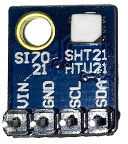
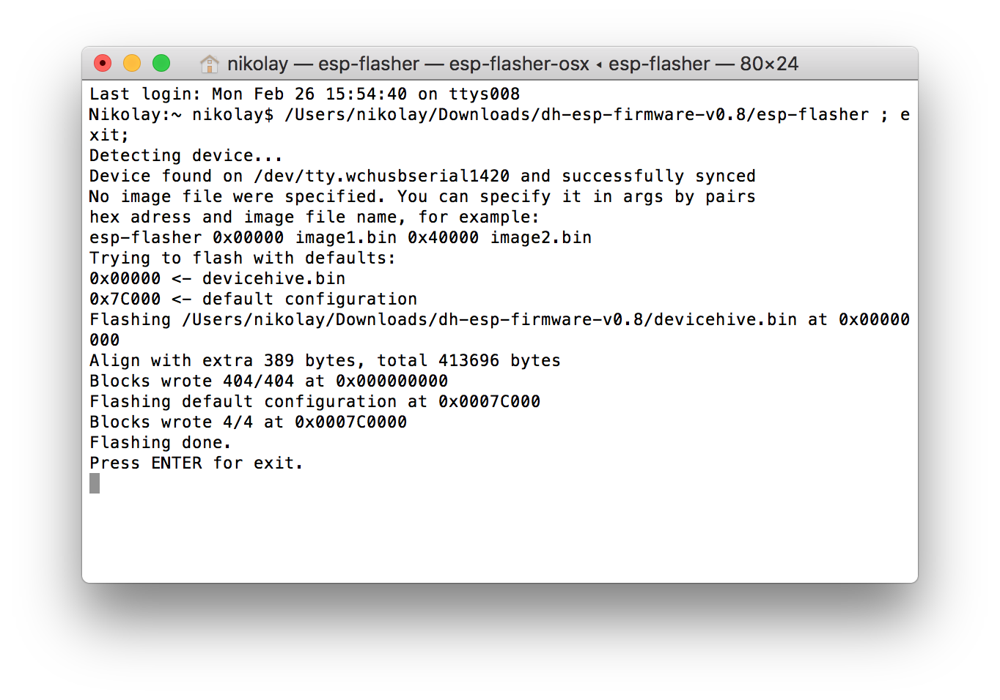
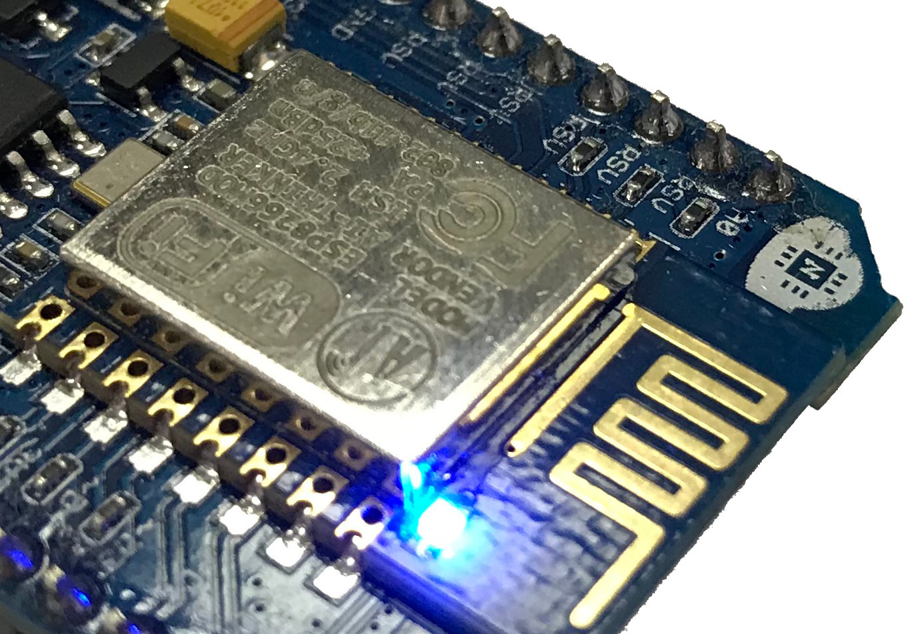
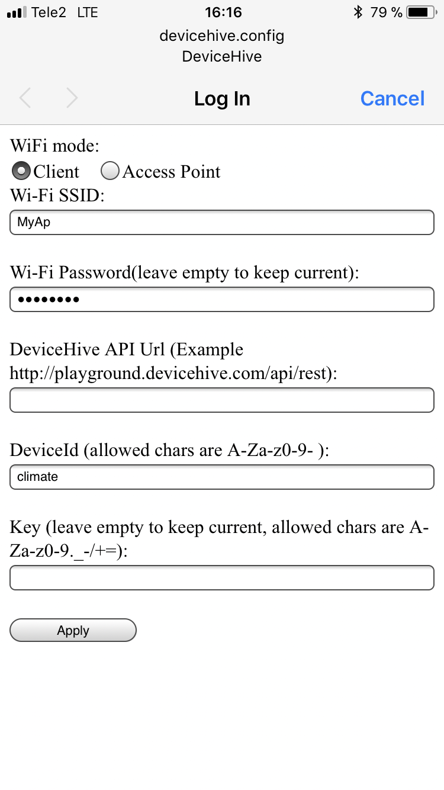
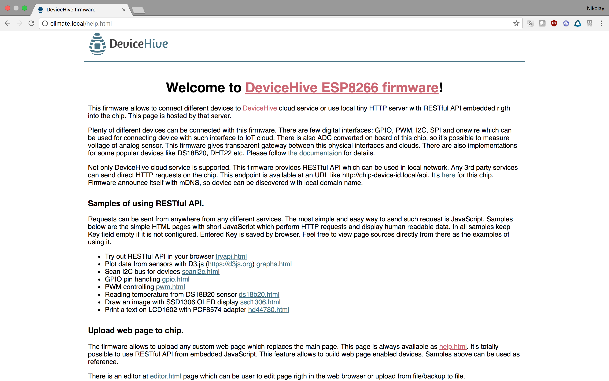
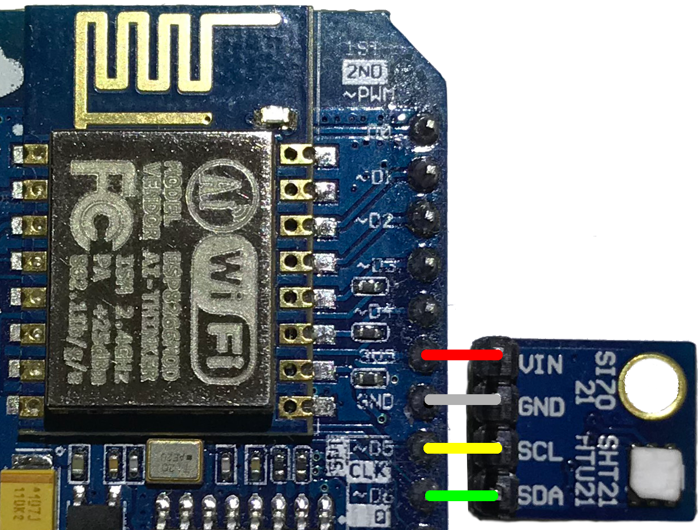
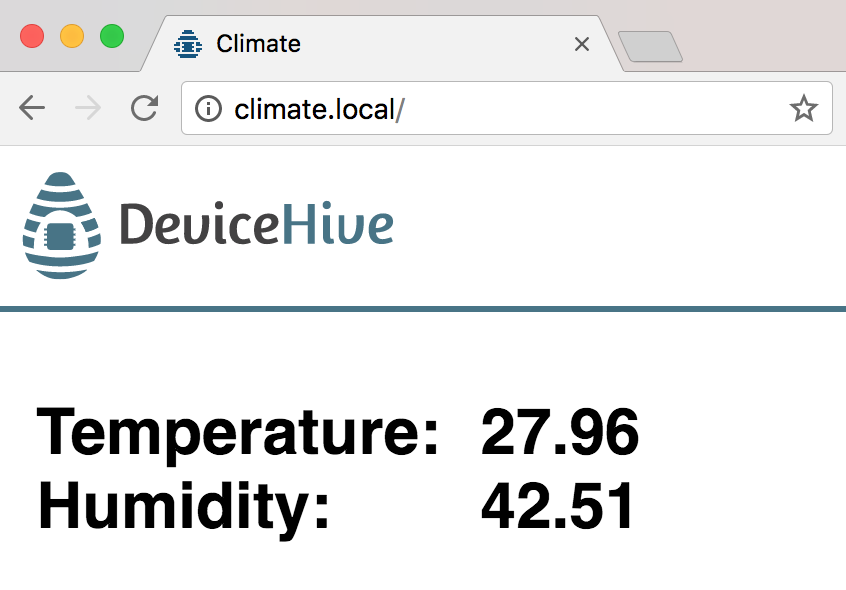

In this tutorial we will describe how to build you own IoT device with a web interface which will be available on the local network. This web interface will show data from a Si7021 sensor: temperature and humidity. The device itself is be based on the ESP8266 Wi-Fi system on chip and uses the [DeviceHive firmware](https://github.com/devicehive/esp8266-firmware).

## 1. Flashing firmware and configure

First of all, the DeviceHive firmware should be flashed onto a board. For this purpose any ESP8266 board with 4MBit flash memory (with an ESP-12E module for example) can be used. Some quite popular boards are the [NodeMCU DevKit](http://www.nodemcu.com/index_en.html#fr_54747661d775ef1a3600009e) and the [Adafruit HUZZAH ESP8266 Breakout board](https://www.adafruit.com/product/2471). Both of them or any similar board can be used. In this article we will use the NodeMCU board because this is the simplest way to use the ESP8266 chip.

[Download the latest firmware binary release](https://github.com/devicehive/esp8266-firmware/releases/latest) from GitHub. Unpack the archive, connect the NodeMCU board with a MicroUSB cable (some OSes might require driver installation) and use the esp-flasher util from the archive. The NodeMCU board doesn't require you to hold any buttons or the connect pin to start flashing. A successful flashing procedure provides output as shown on this screenshot:

After flashing is done, reconnect the board from the USB port to reboot it. If the firmware was flashed for the first time the Blue LED on modules should be on. If the firmware has previously been flashed, then gently press the RESET button on the module three times and the blue LED should turn on.

Now take any mobile phone or laptop with Wi-Fi and connect to the open wireless DeviceHive network. The chip configuration dialog should appear on screen automatically (if not, put this link in the browser: <http://devicehive.config>). Enter you Wi-Fi network name (SSID) and password. Type climate in the device id field, this id is used as the domain address for the device web interface. Leave API Url and Key empty. (If a key was specified then authorization should be implemented in the web interface. In order to simplify this tutorial we will skip this part). Sample configuring screen:

After applying these settings, connect any device with a web browser and mDNS support (for Windows OS, mDNS support can be added by 3rd party applications, for example [this](https://support.apple.com/kb/DL999)). Also, instead of the .local url, the chip's IP address can be used. Open your web browser with this link <http://climate.local.> The default web page is displayed.

## 2. Connect the sensor

Since the Si7021 sensor uses the I2C interface, just 4 wires are required to connect this sensor. The firmware allows to use any GPIO pins as I2C SDA and SCL. So we are free to choose the simplest way to connect the sensor. Connect the sensor according to this circuit diagram:

[block:image]
{
"images": [
{
"image": [
"images/e0a2551-IMG_7528.JPG",
"IMG_7528.JPG",
1280
],
"caption": "You can also use jump wires for connection"
}
]
}
[/block]

Please note, the NodeMCU board is marked with internal pins enumerated with a D prefix. D5 is ESP8266's GPIO14 and D6 is GPIO12 pin.

## 3. Software

Now it's time to implement custom web interface for our devices. As was mentioned previously, the firmware has a web page available at <http://climate.local.> There is a tiny web server with a help page, demos, and a RESTful API. The most pleasant part is that we can upload a custom web page into flash memory and make our device have its own web interface. Let us have a look at the code that will be used to read and display sensor data:

[block:html]
{
"html": ""
}
[/block]

The code is pretty short and simple, but let us break down this code line by line to make it clearer.

**Line 1-6**: file headers, viewport settings for mobile device and import of existing stylesheet and JavaScript module. The embedded pages on chip contain CSS and a tiny JavaScript library. Our sample reuses these resources. The source code for these files is available here - <https://github.com/devicehive/esp8266-firmware/tree/develop/firmware-src/pages>

**Line 7-22**: simple script which runs the send_command() method (from libs.js) in a loop with a 1 second interval. This method implement a simple POST request to the URL <http://climate.local/api/devices/si7021/read>. This URL is a part of the local RESTful API of the chip. The same data can be got with a GET request in a regular browser. The response is simple JSON text with the sensor data. So we display the temperature and humidity on the page with a bit of simple JavaScript.

**Line 24-40**: HTML code with page formatting. Some page elements like the DeviceHive logo are taken from the embedded stylesheet.

Now let us copy this code into the clipboard and go to the page editor at <http://climate.local/editor.html> and paste the code from the clipboard. Click the Flash button. Now the chip is flashed with our own page. Open this url: <http://climate.local> in any browser on the same Wi-Fi network and the current sensor data will be displayed.

## Conclusion

The DeviceHive firmware allows building simple devices that are connected to a cloud service. There is also a nice feature to add a local web interface which can be used separately or together with cloud connectivity. The content for this page can be totally arbitrary and there is a way to add 3rd party components like [D3.js](https://d3js.org/) on the page like it was done in [this](https://github.com/devicehive/esp8266-firmware/blob/develop/firmware-src/pages/graphs.html) sample or it can be used to display data from several sensors on a local network.

Full documentation for the firmware is available [here](https://github.com/devicehive/esp8266-firmware/blob/develop/DeviceHiveESP8266.md).
